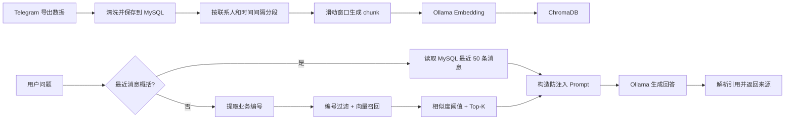

# Telegram 聊天记录智能分析系统

一个面向本地 Telegram 导出数据的 AI 分析项目。系统支持聊天导入与清洗、敏感信息提取、Map-Reduce 全局分析，以及带来源引用的 RAG 问答。

项目当前定位是单机、本地模型演示：业务数据保存在 MySQL 和 ChromaDB，Embedding 与回答均由本机 Ollama 完成，聊天数据不需要发送给第三方模型服务。

## 核心能力

- 导入 Telegram JSON/HTML 聊天记录，并过滤空消息、无效短文本、表情等低价值内容。
- 使用正则提取手机号、银行卡、快递单号、邮箱、账号、URL 等信息。
- 使用 Map-Reduce 对大量消息进行人物、组织、资金、话题和地点分析。
- 按联系人和时间窗口生成聊天向量块，写入 ChromaDB。
- 支持指定联系人问答、精确业务编号约束、相似度过滤和来源引用。
- 对“最近讨论了什么”类问题读取最近 50 条原始消息，避免抽象问题只召回少量向量块。
- 提供可重复执行的检索评估脚本，覆盖正确召回、无关问题拒答和多实体问题。

## RAG 问答链路



### 向量化策略

- 消息先按 `contact_id` 隔离，避免把不同会话拼进同一个 chunk。
- 相邻消息时间差超过 2 小时时切分为新的语义段。
- 每个窗口最多 20 条消息，重叠 2 条，Embedding 文本最多 800 个字符。
- Chroma metadata 保存联系人、起止消息 ID、消息数量、时间和内容哈希。

### 检索策略

普通问题只使用原问题生成一次 Embedding，不调用 LLM 扩写查询：

1. 从问题中提取 `TEST-C208`、`RF-TEST-C208` 等带连字符的业务编号。
2. 如果存在编号，先用 Chroma `where_document` 约束候选文档。
3. 进行向量相似度检索，先取 10 个候选。
4. 使用 `similarity >= 0.5` 过滤，最终最多保留 3 个 chunk。
5. 将来源编号写入 Prompt，生成后只返回模型实际引用的来源。
6. 没有候选结果时直接返回固定拒答，不调用 LLM。

这是一个轻量混合检索方案：精确实体约束负责业务编号，向量检索负责自然语言语义。当前没有引入 BM25、RRF 或 Reranker，因为现阶段评估数据尚未证明这些组件的收益大于复杂度。

## 关键工程决策

| 问题 | 处理方式 | 效果 |
|---|---|---|
| LLM 多查询扩写耗时高 | 删除 LLM 查询扩写，只保留原问题 | 本机观察总耗时从约 44 秒降至 14–17 秒 |
| 无关问题也会召回相似内容 | 增加 0.5 相似度阈值 | “宝可梦价格”等无关问题不再进入生成阶段 |
| 不存在的业务编号误召回 | 编号预过滤并在结果中二次校验 | `TEST-C999` 返回空结果 |
| 回答不可追溯 | Prompt 来源编号 + 响应来源列表 | 前端可展开查看原始聊天片段 |
| Prompt 注入 | 系统消息与用户问题分离，聊天上下文按不可信数据处理 | 诱导模型编造发货状态时仍依据聊天记录回答 |
| 外部服务异常被当成正常拒答 | 定义领域异常并映射 HTTP 状态 | 无答案保持 200，依赖故障返回 502/503 |

耗时受本机模型加载状态和生成 token 数影响。日志将检索与生成耗时分开记录，当前瓶颈主要在本地 7B 模型生成，而不是 Chroma 检索。

## 技术栈

| 层级 | 技术 |
|---|---|
| 前端 | React 18、TypeScript、Ant Design、Vite |
| API | FastAPI、Pydantic v2 |
| 数据访问 | SQLAlchemy、MySQL |
| 大模型 | Ollama、qwen2.5:7b、LangChain |
| Embedding | shaw/dmeta-embedding-zh |
| 向量数据库 | ChromaDB |

## 项目结构

```text
auto_analysis_tg/
├── backend/
│   ├── api/v1/                 # FastAPI 路由
│   ├── chains/                 # Map-Reduce 分析链与 Prompt
│   ├── core/                   # 配置、数据库与领域异常
│   ├── evals/                  # 检索评估数据和运行脚本
│   ├── libs/                   # ChromaDB 封装
│   ├── models/                 # SQLAlchemy 模型
│   ├── repository/             # 数据访问层
│   ├── schemas/                # Pydantic 请求/响应模型
│   ├── services/               # 导入、分析和 RAG 业务逻辑
│   ├── db/db.sql               # MySQL 建表脚本
│   └── main.py                 # FastAPI 入口
├── frontend/src/
│   ├── api/                    # Axios API 封装
│   ├── pages/                  # 任务、导入、分析和问答页面
│   └── types/                  # TypeScript 类型
└── README.md
```

## 本地启动

### 1. 准备 MySQL

```sql
CREATE DATABASE telegram_analysis
CHARACTER SET utf8mb4
COLLATE utf8mb4_unicode_ci;
```

执行 `backend/db/db.sql` 创建数据表，然后创建后端环境文件：

```bash
cp backend/.env.example backend/.env
```

根据本机 MySQL 修改 `backend/.env`。

### 2. 准备 Ollama 模型

```bash
ollama pull qwen2.5:7b
ollama pull shaw/dmeta-embedding-zh
ollama serve
```

### 3. 启动后端

```bash
cd backend
python3 -m venv venv
source venv/bin/activate
pip install -r requirements.txt
uvicorn main:app --reload --port 8000
```

Swagger 地址：`http://127.0.0.1:8000/docs`

### 4. 启动前端

```bash
cd frontend
npm install
npm run dev
```

访问 `http://127.0.0.1:3000`。

## 使用流程

1. 创建分析任务。
2. 导入 Telegram 聊天记录。
3. 根据需要运行敏感信息提取或全局分析。
4. 执行向量化，将聊天 chunk 写入 ChromaDB。
5. 在 AI 问答页面选择全部会话或指定联系人后提问。
6. 展开回答下方的来源，核对联系人、消息范围、相似度和原始内容。

## 主要 API

| 方法 | 路径 | 说明 |
|---|---|---|
| `POST` | `/api/v1/tasks` | 创建任务 |
| `POST` | `/api/v1/chat/import` | 导入聊天记录 |
| `GET` | `/api/v1/tasks/{task_id}/contacts` | 获取任务内联系人 |
| `POST` | `/api/v1/tasks/{task_id}/extract` | 提取敏感信息 |
| `POST` | `/api/v1/tasks/{task_id}/analyze` | 启动全局分析 |
| `POST` | `/api/v1/tasks/{task_id}/vectorize` | 启动向量化 |
| `GET` | `/api/v1/tasks/{task_id}/vectorize-status` | 获取向量化状态 |
| `POST` | `/api/v1/chat/ai` | RAG 问答 |

`POST /api/v1/chat/ai` 的主要响应状态：

- `200`：成功回答，或聊天记录中没有相关信息。
- `404`：任务不存在。
- `409`：任务尚未完成向量化。
- `422`：请求字段、类型或长度校验失败。
- `502`：LLM 返回空内容或不支持的响应格式。
- `503`：Embedding、ChromaDB 或 LLM 服务不可用。

## 检索评估

评估数据位于 `backend/evals/retrieval_cases.json`，当前包含单实体事实、多实体比较、原因查询和无关问题拒答等场景。

```bash
cd backend
venv/bin/python -m evals.run_retrieval_eval <task_id>
```

评估不是根据答案文本测试 LLM，而是检查检索结果是否包含回答所需证据。这样能把“没有召回证据”和“模型没有正确组织答案”分开定位。

当前合成数据集结果为 `7/7`。相似度阈值来自这组数据的经验结果，增加真实数据后需要重新评估，不能把 `0.5` 当成适用于所有模型和数据集的固定标准。

## 当前边界

- 当前是本地单用户项目，没有登录、任务所有权和接口限流，不应直接暴露到公网。
- “最近讨论”读取最近 50 条消息；面向全部历史数据的全局概括使用独立 Map-Reduce 分析，不走 Top-3 RAG。
- 检索评估以合成业务数据为主，仍需要补充匿名化真实数据。
- 当前检索规模尚未证明 BM25、Reranker、复杂 Agent 或对话记忆的必要性。
- 本地 qwen2.5:7b 的生成速度取决于硬件和模型热启动状态。

## 60 秒项目介绍

> 这是一个本地部署的 Telegram 聊天分析系统。用户导入聊天后，系统先将结构化消息保存到 MySQL，再按联系人、两小时时间段和滑动窗口生成向量块，使用中文 Embedding 写入 ChromaDB。问答时我没有盲目堆叠多查询和 Reranker，而是根据评估结果采用“业务编号精确过滤 + 向量语义检索”的轻量混合方案，再做相似度阈值和 Top-K 控制。回答要求引用原始聊天来源，前端可以查看对应消息范围和内容；无关问题直接拒答，不调用大模型。我还把检索评估和 LLM 生成分开验证，并用 502、503 区分模型响应异常和依赖服务不可用。这个项目让我完整实践了数据清洗、向量化、RAG 检索、Prompt 安全、效果评估和前后端联调。
